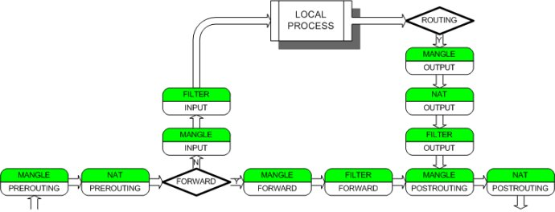

iptables应用初探
===
iptables是一个Linux下优秀的nat+防火墙工具，我使用该工具以较低配置的传统pc配置了一个灵活强劲的防火墙+nat系统,小有心得，看了网上也有很多这方面的文章，但是似乎要么说的比较少，要么就是比较偏，内容不全，容易误导，我研究了一段时间的iptables同时也用了很久，有点滴经验，写来供大家参考，同时也备日后自己翻阅。

首先要说明的是，iptables操作的是2.4以上内核的netfilter.所以需要linux的内核在2.4以上。其功能与安全性远远比其前辈 ipfwadm,ipchains强大，iptables大致是工作在OSI七层的二、三、四层，其前辈ipchains不能单独实现对tcp/udp port以及对mac地址的的定义与操作，所以我想ipchains应该是仅仅工作在三层上的。

我们先简单介绍一下netfilter的大致工作流程，也就是一个数据包（或者叫分组、packet,我个人习惯叫包）在到达linux的网络接口的时候（网卡）如何处理这个包，然后再介绍一下如何用iptables改变或者说控制对这个数据包进行操作。netfilter内部分为三个表，分别是 filter,nat,mangle，每个表又有不同的操作链（Chains）。在filter（过滤）表中，也就是他的防火墙功能的这个表，定义了三个 Chain。分别是INPUT,FORWARD,OUTPUT。也就是对包的入、转发、出进行定义的三个过滤链。对于这个filter表的操作和控制也是我们实现防火墙功能的一个重要手段；在nat(Network Address Translation、网络地址翻译)表中，也就是我们用以实现地址转换和端口转发功能的这个表，定义了PREROUTING, POSTROUTING,OUTPUT三个链,下面我们会对这三个链作详细的说明；而netfilter的mangle表则是一个自定义表，里面包括上面的filter以及nat表中的各种chains,它可以让我们进行一些自定义的操作，同时这个mangle表中的chains在netfilter对包的处理流程中处在一个比较优先的位置，下面有一张图清晰的描绘了netfilter对包的处理流程（该图摘自网上，不知作者是谁，在此深表敬意！），一般情况下，我们用不到这个mangle表，在这里我们就不做介绍了。



大家可以看到，PREROUTING这个chain在最前面，当一个包来到linux的网络接口的时候先过mangle的PREROUTING,然后是 nat的PREROUTING,从这个chain的名字我们可以看出，这个chain是在路由之前(pre-routing)要过的。为什么要在路由之前过呢？大家可以看到这个图上，上面有一个菱形的部分叫ROUTING,这个ROUTING部分就是Linux的route box,也就是路由系统，它同样有很高深的功能，可以实现策略路由等等一些高级特性，此处我们不做详细解释。单说这个PREROUTING链，因为在这个链里面我们对包的操作是DNAT,也就是改变目的地址和（或端口），通常用在端口转发，或者nat到内网的DMZ区，也就是说当一个包过来的时候我们要改变它的目的地址，大家可以想想,如果一个包在改变目的地址之前就被扔进了route box,让系统选好路之后再改变目的地址，那么选路就可能是错的，或者说毫无意义了，所以，PREROUTING这个Chain一定要在进Routing 之前做。比如说，我们的公网ip是60.1.1.1/24,位于linux中的eth0,内网ip是10.1.1.1/24位于linux中的eth1, 我们的内网有一台web服务器，地址是10.1.1.2/24,我们怎么样能让internet用户通过这个公网ip访问我们内部的这个web服务器呢？我们就可以在这个PREROUTING链上面定义一个规则，把访问60.1.1.1:80的用户的目的地址改变一下，改变为10.1.1.2:80,这样就实现了internet用户对内网服务器的访问了，当然了，这个端口是比较灵活的，我们可以定义任何一个端口的转发，不一定是80-->80，具体的命令我们在下面的例子中介绍，这里我们只谈流程与概念上的实现方法。

好了，我们接着往下走，这个包已经过了两个PREROUTING链了，这个时候，出现了一个分支转折的地方，也就是图中下方的那个菱形（FORWARD）,转发！这里有一个对目的地址的判断（这里同样说明了PREROUTING一定要在最先，不仅要在route box之前，甚至是这个对目的地址的判断之前，因为我们可能做一个去某某某ip的地方转到自己的ip的规则，所以PREROUTING是最先处理这个包的 Chain）！如果包的目的地是本机ip,那么包向上走，走入INPUT链处理，然后进入LOCAL PROCESS,如果非本地，那么就进入FORWARD链进行过滤，我们在这里就不介绍INPUT,OUTPUT的处理了，因为那主要是对于本机安全的一种处理，我们这里主要说对转发的过滤和nat的实现。

这里的FORWARD我简单说一下，当linux收到了一个目的ip地址不是本地的包，Linux会把这个包丢弃，因为默认情况下，Linux的三层包转发功能是关闭的，如果要让我们的linux实现转发，则需要打开这个转发功能，可以改变它的一个系统参数，使用sysctl net.ipv4.ip_forward=1或者echo "1" > /proc/sys/net/ipv4/ip_forward命令打开转发功能。好了，在这里我们让linux允许转发，这个包的目的地址也不是本机，那么它将接着走入FORWARD链，在FORWARD链里面，我们就可以定义详细的规则，也就是是否允许他通过，或者对这个包的方向流程进行一些改变，这也是我们实现访问控制的地方，这里同样也是Mangle_FORWARD然后filter_FORWARD,我们操作任何一个链都会影响到这个包的命运，在下面的介绍中，我们就忽略掉mangle表，我们基本用不到操作它，所以我们假设它是透明的。假设这个包被我们的规则放过去了，也就是ACCEPT了，它将进入POSTROUTING部分，注意！这里我注意到一个细节问题，也就是上面的图中数据包过了FORWARD链之后直接进入了POSTROUITNG 链，我觉得这中间缺少一个环节，也就是route box,对于转发的包来说，linux同样需要在选路（路由）之后才能将它送出，这个图却没有标明这一点，我认为它是在过了route box之后才进入的POSTROUITNG,当然了，这对于我们讨论iptables的过滤转发来说不是很重要，只是我觉得流程上有这个问题，还是要说明一下。

同样的，我们在这里从名字就可以看出，这个POSTROUTING链应该是路由之后的一个链，也就是这个包要送出这台Linux的最后一个环节了，这也是极其重要的一个环节！！这个时候linux已经完成(has done..^_^)了对这个包的路由（选路工作），已经找到了合适的接口送出这个包了，在这个链里面我们要进行重要的操作，就是被Linux称为 SNAT的一个动作，修改源ip地址！为什么修改源ip地址？很多情况需要修改源地址阿，最常见的就是我们内网多台机器需要共享一个或几个公网ip访问 internet,因为我们的内网地址是私有的，假如就让linux给路由出去，源地址也不变，这个包应该能访问到目的地，但是却回不来，因为 internet上的N多个路由节点不会转发私有地址的数据包，也就是说，不用合法ip,我们的数据包有去无回。有人会说：“既然是这样，我就不用私有 ip了，我自己分配自己合法的地址不行吗？那样包就会回来了吧？”答案是否定的，ip地址是ICANN来分配的，你的数据包或许能发到目的地，但是回来的时候人家可不会转到你那里，internet上的路由器中的路由信息会把这个返回包送到那个合法的获得ip的地方去，你同样收不到,而你这种行为有可能被定义为一种ip欺骗，很多设备会把这样的包在接入端就给滤掉了，可能都到不了你要访问的那个服务器，呵呵。

那么Linux如何做SNAT呢？比如一个内网的10.1.1.11的pc访问202.2.2.2的一个web服务器，linux的内网接口10.1.1.1在收到这个包之后把原来的PC的 ip10.1.1.11改变为60.1.1.1的合法地址然后送出，同时在自己的ip_conntrack表里面做一个记录,记住是内网的哪一个ip的哪个端口访问的这个web服务器，自己把它的源地址改成多少了，端口改成多少了，以便这个web服务器返回数据包的时候linux将它准确的送回给发送请求的这个pc. 

大体的数据转发流程我们说完了,我们看看iptables使用什么样的参数来完成这些操作。
在描述这些具体的操作之前，我还要说几个我对iptables的概念的理解（未必完全正确），这将有助于大家理解这些规则，以实现更精确的控制。上文中我们提到过，对包的控制是由我们在不同的Chain(链)上面添加不同的规则来实现的，比如我们对过滤表（filter table）添加规则来执行对包的操控。那么既然叫链，一定就是一条或者多条规则组成的了，这时就有一个问题了，如果多个规则对同一种包进行了定义，会发生什么事情呢？在Chain中，所有的规则都是从上向下来执行的，也就是说，如果匹配了第一行，那么就按照第一行的规则执行，一行一行的往下找，直到找到符合这个类型的包的规则为止。如果找了一遍没有找到符合这个包的规则怎么办呢？itpables里面有一个概念，就是Policy,也就是策略。一说这个东西大家可能就会觉得比较麻烦，什么策略阿，我对于它的理解就是所谓这个策略就是chain中的最后一条规则，也就是说如果找了一遍找不到符合处理这个包的规则，就按照policy来办。这样理解起来就容易多了。iptables 使用-P来设置Chain的策略。

好了，我们言归正传，来说说iptables到底怎样实现对包的控制

先介绍一下iptables如何操作链
对链的操作就那么几种:
* -I(插入) 
* -A(追加) 
* -R(替换) 
* -D（删除） 
* -L（列表显示）

这里要说明的就是-I将会把规则放在第一行，-A将会放在最后一行。

比如我们要添加一个规则到filter表的FORWARD链
```shell
iptables -t filter -A FORWARD -s 10.1.1.11 -d 202.1.1.1 -j ACCEPT
```
上面的命令意思为：追加一个规则至filter表中的FORWARD链尾，允许（-j ACCEPT）源地址为10.1.1.11目的地址为202.1.1.1的数据包通过。其中-t后面跟的是表名，在-A后面跟Chain名，后面的小写的 -s为源地址，-d为目的地址，-j为处理方向。
在iptables中，默认的表名就是filter，所以这里可以省略-t filter直接写成:`iptables -A FORWARD -s 10.1.1.11 -d 202.1.1.1 -j ACCEPT`

iptables中的匹配参数：
我们在这里就介绍几种常用的参数，详细地用法可以man iptables看它的联机文档，你会有意外的收获。
* -s匹配源地址
* -d匹配目的地址
* -p协议匹配
* -i入接口匹配
* -o出接口匹配
* --sport，--dport源和目的端口匹配
* -j跳转,也就是包的方向
* 其中还有一个!参数，使用!就是取反的意思。

下面我们简单举几个例子介绍一下。
-s这个参数呢就是指定源地址的，如果使用这个参数也就是告诉netfilter，对于符合这样一个源地址的包怎么去处理，可以指定某一个单播ip地址，也可以指定一个网络，如果单个的ip地址其实隐含了一个32位的子网掩码，比如-s 10.1.1.11 其实就是-s 10.1.1.11/32 同样我们可以指定不同的掩码用以实现源网络地址的规则，比如一个C类地址我们可以用-s 10.1.1.0/24来指定。
-d参数与-s格式一样。
-i参数是指定入接口的网络接口，比如我仅仅允许从eth3接口过来的包通过FORWARD链，就可以这样指定iptables -A FORWARD -i eth3 -j ACCEPT
-o是出接口,与上同.

我们下面用一些简单的实例来step by step看看iptables的具体配置方法。

实例一：简单的nat路由器
环境介绍：
linux 2.4 +
2个网络接口
Lan口:10.1.1.254/24 eth0
Wan口:60.1.1.1/24 eth1
目的：实现内网中的节点（10.1.1.0/24）可控的访问internet。


首先将Lan的节点pc的网关指向10.1.1.254
确定你的linux的ip配置无误，可以正确的ping通内外的地址。同时用route命令查看linux的本地路由表，确认指定了可用的ISP提供的默认网关。
使用sysctl net.ipv4.ip_forward=1打开linux的转发功能。


iptables -P FORWARD DROP
将FORWARD链的策略设置为DROP，这样做的目的是做到对内网ip的控制，你允许哪一个访问internet就可以增加一个规则，不在规则中的ip将无法访问internet.


iptables -A FORWARD -m state --state ESTABLISHED,RELATED -j ACCEPT
这条规则规定允许任何地址到任何地址的确认包和关联包通过。一定要加这一条，否则你只允许lan IP访问没有用，至于为什么，下面我们再详细说。


iptables -t nat -A POSTROUTING -s 10.1.1.0/24 -j SNAT --to 60.1.1.1
这条规则做了一个SNAT，也就是源地址转换，将来自10.1.1.0/24的地址转换为60.1.1.1


有这几条规则，一个简单的nat路由器就实现了。这时你可以将允许访问的ip添加至FORWARD链，他们就能访问internet了。


比如我想让10.1.1.9这个地址访问internet,那么你就加如下的命令就可以了。
iptables -A FORWARD -s 10.1.1.9 -j ACCEPT


也可以精确控制他的访问地址,比如我就允许10.1.1.99访问3.3.3.3这个ip
iptables -A FORWARD -s 10.1.1.99 -d 3.3.3.3 -j ACCEPT


或者只允许他们访问80端口。
iptables -A FORWARD -s 10.1.1.0/24 -p tcp --dport http -j ACCEPT
更多的控制可以自己灵活去做,或者查阅iptables的联机文档。


实例二：端口转发

环境介绍：
linux 2.4 +
2个网络接口
Lan口:10.1.1.254/24 eth0
Lan内web server: 10.1.1.1:80
Lan内ftp server: 10.1.1.2:21
Wan口:60.1.1.1/24 eth1
目的：对内部server进行端口转发实现internet用户访问内网服务器


同样确认你的linux的各项配置正常，能够访问内外网。
iptables -P FORWARD DROP
iptables -A FORWARD -m state --state ESTABLISHED,RELATED -j ACCEPT
也需要加入确认包和关联包的允许通过


如果你要把访问60.1.1.1:80的数据包转发到Lan内web server,用下面的命令
iptables -t nat -A PREROUTING -d 60.1.1.1 -p tcp --dport 80 -j DNAT --to 10.1.1.1:80
ftp服务也同样，命令如下：
iptables -t nat -A PREROUTING -d 60.1.1.1 -p tcp --dport 21 -j DNAT --to 10.1.1.2:21


好了，命令完成了，端口转发也做完了，本例能不能转发呢？不能，为什么呢？我下面详细分析一下。对于iptables好像往外访问的配置比较容易，而对内的转发似乎就有一些问题了，在一开始的时候我就先说了一些关于netfilter的流程问题，那么我就简单说说做了这些配置之后为什么有可能还不行呢？


能引起这个配置失败的原因有很多，我们一个个的来说：
第一，本例中，我们的FORWARD策略是DROP,那么也就是说，没有符合规则的包将被丢弃，不管内到外还是外到内，我们在这里依然不讨论那个确认包和关联包的问题，我们不用考虑他的问题，下面我会详细说一下这个东西，那么如何让本例可以成功呢？加入下面的规则。
iptables -A FORWARD -d 10.1.1.1 -p tcp --dport 80 -j ACCEPT
iptables -A FORWARD -d 10.1.1.2 -p tcp --dport 21 -j ACCEPT
有没有觉得有一些晕？为什么目的地址是10.xxx而不是60.xxx人家internet用户不是访问的60.xxx吗？呵呵，回到上面看看那个图吧， FORWARD链在什么位置上，它是在PREROUTING之后，也就是说当这个包到达FORWARD链的时候，目的地址已经变成10.xxx了，假如 internet用户的请求是这样202.1.1.1:1333-->60.1.1.1:80，在经过了我们的PREROUTING链之后将变成 202.1.1.1:1333-->10.1.1.1:80,这个时候如果你设置一个目的地址为60.xxx的规则有用吗？呵呵，这是问题一。这个时候应该可以完成端口转发的访问了，但是有一些时候还是不行？为什么？看问题二。
第二，内网server的ip配置问题，这里我们以web server为例说明一下（ftp情况有一些特殊，下面我们再详细讨论，说确认包和关联包的时候讨论这个问题），上面说到，有的时候可以访问了，有的时候却不行，就是这个web server的ip设置问题了，如果web server没有指定默认的网关，那么在作了上面的配置之后，web server会收到internet的请求，但是，他不知道往哪里回啊，人家的本地路由表不知道你那个internet的ip,202.1.1.1该怎么走。如果你使用截包工具在web server上面察看，你会发现server收到了来自202.1.1.1:1333-->10.1.1.1:80的请求，由于你没有给web server配置默认网关，它不知道怎么回去，所以就出现了不通的情况。怎么办呢？两个解决方法：一就是给这个server配置一个默认网关，当然要指向这个配置端口转发的linux,本例是10.1.1.254,配置好了，就一定能访问了。有一个疑问？难道不需要在FORWARD链上面设置一个允许 web server的ip地址访问外网的规则吗？它的包能出去？答案是肯定的，能出去。因为我们那一条允许确认包与关联包的规则，否则它是出不去的。第二种方法，比较麻烦一些，但是对服务器来说这样似乎更安全一些。方法就是对这个包再作一次SNAT，也就是在POSTROUTING链上添加规则。命令如下：
iptables -t nat -A POSTROUTING -d 10.1.1.1 -p tcp --dport 80 -j SNAT --to 10.1.1.254
ftp的方法相同。这条命令不太好懂？？其实很简单，如果使用这条命令，那么你的web server不需要再设置默认网关，就能收到这个请求，只要他和linux的lan ip地址是能互访的（也就是说web server和Linux的Lan ip在一个广播域），我们在根据上面的netfilter流程图来分析这个包到底被我们怎么样了，首先一个请求202.1.1.1:1333--> 60.1.1.1:80被linux收到了，进入PREROUTING,发现一个规则（iptables -t nat -A PREROUTING -d 60.1.1.1 -p tcp --dport 80 -j DNAT --to 10.1.1.1:80）符合，好了，改你的目的地址，于是这个包变成了202.1.1.1:1333-->10.1.1.1:80，继续往前走，进入FORWARD链，okay,也有一条规则允许通过(iptables -A FORWARD -d 10.1.1.1 -p tcp --dport 80 -j ACCEPT)，进入route box选路，找到合适的路径了，继续进入POSTROUTING链，耶？又发现一个符合的规则(iptables -t nat -A POSTROUTING -d 10.1.1.1 -p tcp --dport 80 -j SNAT --to 10.1.1.254),原来是一个SNAT,改你的源地址，于是这个包变成了10.1.1.254:xxxx-->10.1.1.1:80。为什么用xxxx了，这里的端口是随机的，我也不知道会是什么。而整个的两次变化的过程都会记录在linux的ip_conntrack中，当web server收到这个包的时候，发现，原来是一个内网自己兄弟来的请求阿，又在一个广播域，不用找网关，把返回包直接扔给交换机了，linux在收到返回包之后，会根据他的ip_conntrack中的条目进行两次变换，返回真正的internet用户，于是完成这一次的访问。


看了上面的两个例子，不知道大家是否清楚了iptables的转发流程，希望对大家有所帮助，下面我们就说说我一直在上面提到的关于那个 ESTABLISHED,RELATED的规则是怎么回事，到底有什么用处。说这个东西就要简单说一下网络的数据通讯的方式，我们知道，网络的访问是双向的，也就是说一个Client与Server之间完成数据交换需要双方的发包与收包。在netfilter中，有几种状态，也就是new, established,related,invalid。当一个客户端，在本文例一中，内网的一台机器访问外网，我们设置了规则允许他出去，但是没有设置允许回来的规则阿，怎么完成访问呢？这就是netfilter的状态机制，当一个lan用户通过这个linux访问外网的时候，它发送了一个请求包，这个包的状态是new,当外网回包的时候他的状态就是established,所以，linux知道，哦，这个包是我的内网的一台机器发出去的应答包，他就放行了。而外网试图对内发起一个新的连接的时候，他的状态是new,所以linux压根不去理会它。这就是我们为什么要加这一句的原因。还有那个 related,他是一个关联状态，什么会用到呢？tftp,ftp都会用到，因为他们的传输机制决定了，它不像http访问那样，Client_IP: port-->server:80  然后server:80-->Client_IP:port,ftp使用tcp21建立连接，使用20端口发送数据，其中又有两种方式，一种主动 active mode,一种被动passive mode,主动模式下，client使用port命令告诉server我用哪一个端口接受数据，然后server主动发起对这个端口的请求。被动模式下， server使用port命令告诉客户端，它用那个端口监听，然后客户端发起对他的数据传输，所以这对于一个防火墙来说就是比较麻烦的事情，因为有可能会有new状态的数据包，但是它又是合理的请求，这个时候就用到这个related状态了，他就是一种关联，在linux中，有个叫 ftp_conntrack的模块，它能识别port命令，然后对相应的端口进行放行。

————————————————————

一口气写了这么多东西，不知道质量如何，大家凑和着看吧，希望多多交流共同进步，我还是一个linux的初学者，难免很多谬误，希望高手赐教指正，以期不断进步。


————————————————————

对了，还有几个在实际中比较实用（也比较受用:-)）的命令参数，写出来供大家参考

iptables -L -n
这样的列表会跳过linux的domain lookup,有的时候使用iptables -L会比较慢，因为linux会尝试解析ip的域名，真是罗嗦，如果你的dns server比较不爽的话，iptables -L就会让你很不爽，加一个-n参数就好了。列表刷的就出来。当然了，如果你的linux就是做防火墙，建议把nameserver去掉，在 /etc/resolve.conf里面，因为有时候使用route命令也会比较慢列出来，很是不爽。


iptables -L -v
这个命令会显示链中规则的包和流量计数，嘿嘿，看看哪些小子用的流量那么多，用tc限了他。


cat /proc/net/ip_conntrack
查看目前的conntrack，可能会比较多哦，最好加一个|grep "关键字"，看看你感兴趣的链接跟踪


wc -l /proc/net/ip_conntrack
看看总链接有多少条。


iptables-save >/etc/iptables
把当前的所有链备份一下，之所以放到/etc下面叫iptables,因为这样重起机器的时候会自动加载所有的链，经常地备份一下吧，否则如果链多，万一掉电重启，你还是会比较痛苦。

[链接](https://blog.csdn.net/djvc/article/details/8573084)