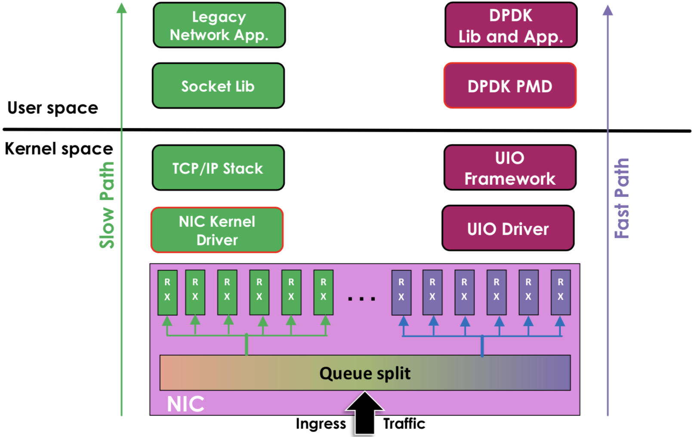

DPDK
===

## 背景


### 基于OS内核的数据传输的弊病
#### 1. 中断处理：
当网络中大量数据包到来时，会产生频繁的硬件中断请求，这些硬件中断可以打断之前较低优先级的软中断或者系统调用的执行过程，如果这种打断频繁的话，将会产生较高的性能开销。

#### 2. 内存拷贝
正常情况下，一个网络数据包从网卡到应用程序需要经过如下的过程：数据从网卡通过 DMA 等方式传到内核开辟的缓冲区，然后从内核空间拷贝到用户态空间，在 Linux 内核协议栈中，这个耗时操作甚至占到了数据包整个处理流程的 57.1%。

#### 3. 上下文切换
频繁到达的硬件中断和软中断都可能随时抢占系统调用的运行，这会产生大量的上下文切换开销。另外，在基于多线程的服务器设计框架中，线程间的调度也会产生频繁的上下文切换开销，同样，锁竞争的耗能也是一个非常严重的问题。

#### 4. 局部性失效
如今主流的处理器都是多个核心的，这意味着一个数据包的处理可能跨多个 CPU 核心，比如一个数据包可能中断在 cpu0，内核态处理在 cpu1，用户态处理在 cpu2，这样跨多个核心，容易造成 CPU 缓存失效，造成局部性失效。如果是 NUMA 架构，更会造成跨 NUMA 访问内存，性能受到很大影响。

#### 5. 内存管理
传统服务器内存页为 4K，为了提高内存的访问速度，避免 cache miss，可以增加 cache 中映射表的条目，但这又会影响 CPU 的检索效率。

### 上面问题的解决方案
#### 1. 控制层和数据层分离
将数据包处理、内存管理、处理器调度等任务转移到用户空间去完成，而内核仅仅负责部分控制指令的处理。这样就不存在上述所说的系统中断、上下文切换、系统调用、系统调度等等问题。

#### 2. 多核技术
使用多核编程技术代替多线程技术，并设置 CPU 的亲和性，将线程和 CPU 核进行一比一绑定，减少彼此之间调度切换。

#### 3. NUMA亲和性
针对 NUMA 系统，尽量使 CPU 核使用所在 NUMA 节点的内存，避免跨内存访问。

#### 4. 大页内存
使用大页内存代替普通的内存，减少 cache-miss。

#### 5. 无锁技术
采用无锁技术解决资源竞争问题。

## DPDK

DPDK 为 Intel 处理器架构下用户空间高效的数据包处理提供了库函数和驱动的支持，它不同于 Linux 系统以通用性设计为目的，而是专注于网络应用中数据包的高性能处理。

也就是 DPDK 绕过了 Linux 内核协议栈对数据包的处理过程，在用户空间实现了一套数据平面来进行数据包的收发与处理。在内核看来，DPDK 就是一个普通的用户态进程，它的编译、连接和加载方式和普通程序没有什么两样。

### 传统数据流程和DPDK中网络流程的区别
1. 传统Linux内核网络数据流程
```
硬件中断 ---> 取包分发至内核线程 ---> 软件中断 ---> 内核线程在协议栈中处理包 ---> 处理完毕通知用户层
用户层收包 ---> 网络层 ---> 逻辑层 ---> 业务层
```
2. DPDK网络数据流程
```
硬件中断 ---> 放弃中断流程
用户层通过设备映射取包 ---> 进入用户层协议栈 ---> 逻辑层 ---> 业务层
```



上图左边是传统方式，数据从 网卡->驱动->协议栈->socket接口->业务
右边是DPDK的方式，基于UIO(Userspace I/O)旁路数据。数据从 网卡->DPDK轮询模式->DPDK基础库->业务

用户态的好处是易于开发和维护、灵活性好。并且crash也不影响内核运行，鲁棒性强。

DPDK支持的CPU体系架构：x86、ARM、PowerPC（PPC）
DPDK支持的网卡列表：https://core.dpdk.org/supported

### DPDK的突破
#### 1. UIO(用户空间的I/O)

为了让驱动运行在用户态，linux提供UIO机制。使用UIO可以通过read感知中断，通过mmap实现和网卡的通讯。


UIO设备的实现机制其实是对用户空间暴露文件接口，比如当注册一个UIO设备uioX，就会出现文件/dev/uioX，对该文件的读写就是对设备内存的读写。除此之外，对设备的控制还可以通过/sys/class/uio下的各个文件的读写来完成。

要开发用户态驱动有几个步骤：
* 开发运行在内核的UIO模块，因为硬终端只能在内核处理
* 通过/dev/uioX读取中断
* 通过mmap和外设共享内存

#### 2. 内存池技术

DPDK在用户空间实现了一套精巧的内存池技术，内核空间和用户空间的内存交互不进行拷贝，只做控制权转移。这样，当收到数据包时，就减少了内存拷贝的开销。

#### 3. 大内存管理

DPDK实现了一组大页内存分配、使用和释放的API，上层应用可以很方便使用API申请使用大页内存，同时也兼顾普通的内存申请。

#### 4. 无锁环形队列

DPDK基于Linux内核的无锁环形缓冲kfifo实现了自己的一套无锁机制。支持单生产者入列/单消费者出列和多生产者入列/多消费者出列操作，在数据传输的时候，降低性能的同时还能保持数据的同步。

#### 5. poll-mode网卡驱动

DPDK网卡驱动完全抛弃中断模式，基于轮询方式收包，避免了中断开销。

#### 6. NUMA

DPDK内存分配上通过proc提供的内存信息，使CPU核心尽量使用靠近其所在节点的内存，避免了跨NUMA节点远程访问内存的性能问题。

#### 7. CPU亲和性

DPDK利用CPU的亲和性将一个线程或多个线程绑定到一个或多个CPU上，这样在线程执行过程中，就不会被随意调度，一方面减少了线程间的频繁切换带来的开销，另一方面避免了 CPU 缓存的局部失效性，增加了 CPU 缓存的命中率。

### DPDK核心优化： PMD

DPDK的UIO驱动屏蔽了硬件发出中断，然后在用户态采用主动轮询的方式，这种模式被称为PMD（Poll Mode Driver）。

UIO旁路了内核，主动轮询去掉硬中断，DPDK从而可以在用户态做收发包处理。带来Zero Copy、无系统调用的好处，同步处理减少上下文切换带来的Cache Miss。

运行在PMD的Core会处于用户态CPU100%的状态

网络空闲时CPU长期空转，会带来能耗问题。所以，DPDK推出Interrupt DPDK模式。


它的原理和NAPI很像，就是没包可处理时进入睡眠，改为中断通知。并且可以和其他进程共享同个CPU core，但是DPDK进程会有更高调度优先级。

### DPDK实现高性能的其它原因
#### 1. 采用HugePage减少TLB Miss
默认下Linux采用4KB为一页，页越小内存越大，页表的开销越大，页表的内存占用也越大。CPU有TLB（Translation Lookaside Buffer）成本高所以一般就只能存放几百到上千个页表项。如果进程要使用64G内存，则64G/4KB=16000000（一千六百万）页，每页在页表项中占用16000000 * 4B=62MB。如果用HugePage采用2MB作为一页，只需64G/2MB=2000，数量不在同个级别。

而DPDK采用HugePage，在x86-64下支持2MB、1GB的页大小，几何级的降低了页表项的大小，从而减少TLB-Miss。并提供了内存池（Mempool）、MBuf、无锁环（Ring）、Bitmap等基础库。根据我们的实践，在数据平面（Data Plane）频繁的内存分配释放，必须使用内存池，不能直接使用rte_malloc，DPDK的内存分配实现非常简陋，不如ptmalloc。

#### 2. SNA (Shared-nothing Architecture)

软件架构去中心化，尽量避免全局共享，带来全局竞争，失去横向扩展的能力。NUMA体系下不跨Node远程使用内存。

#### 3. SIMD (Single Instruction Multiple Data)

从最早的mmx/sse到最新的avx2，SIMD的能力一直在增强。DPDK采用批量同时处理多个包，再用向量编程，一个周期内对所有包进行处理。比如，memcpy就使用SIMD来提高速度。

SIMD在游戏后台比较常见，但是其他业务如果有类似批量处理的场景，要提高性能，也可看看能否满足。

参考：
1. https://www.itcodemonkey.com/article/7930.html
2. https://www.cnblogs.com/qcloud1001/p/9585724.html

