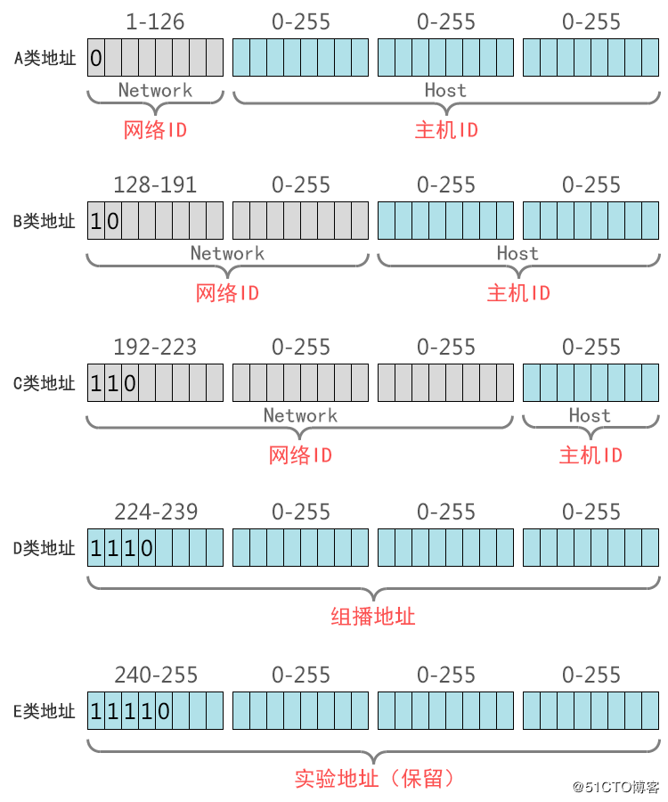

IP地址划分
===
## IPV4

### IP地址分类详解
IP地址分A、B、C、D、E五类，其中A、B、C这三类是比较常用的IP地址，D、E类为特殊地址。

#### 1、A类地址
1. A类地址第1字节为网络地址（最高位固定是0），另外3个字节为主机地址。
2. A类地址范围：1.0.0.0 - 126.255.255.255，其中0和127作为特殊地址。
3. A类网络默认子网掩码为255.0.0.0，也可写作/8
4. A类网络最大主机数量是256×256×256-2=166777214（减去1个主机位为0的网络地址和1个广播地址）。

> 在计算机网络中，主机ID全部为0的地址为网络地址，而主机ID全部为1的地址为广播地址，这2个地址是不能分配给主机用的。

#### 2、B类地址
1. B类地址第1字节（最高位固定是10）和第2字节为网络地址，另外2个字节为主机地址。
2. B类地址范围：128.0.0.0 - 191.255.255.255。
3. B类网络默认子网掩码为255.255.0.0，也可写作/16。
4. B类网络最大主机数量256×256-2=6554。

#### 3、C类地址
1. C类地址第1字节（最高位固定是110）、第2字节和第3个字节，另外1个字节为主机地址。
2. C类地址范围：192.0.0.0 - 223.255.255.255
3. C类网络默认子网掩码为255.255.255.0，也可写作/24。
4. C类网络最大主机数量256-2=254。

#### 4、D类地址
1. D类地址不分网络地址和主机地址，它的第1个字节的最高位固定是1110。
2. D类地址用于组播（也称为多播）的地址，无子网掩码。
3. D类地址范围：224.0.0.0 - 239.255.255.255

#### 5、E类地址
1. E类地址也不分网络地址和主机地址，它的第1个字节的最高位固定是11110
2. E类地址范围：240.0.0.0 - 255.255.255.255。
3. 其中240.0.0.0-255.255.255.254作为保留地址，主要用于Internet试验和开发，255.255.255.255作为广播地址

### 私网IP地址
A类 10.0.0.0~10.255.255.255，保留1个A类网络
B类 172.16.0.0~172.31.255.255，保留了16个B类网络
C类 192.168.0.0~192.168.255.255，保留了256个C类网络
