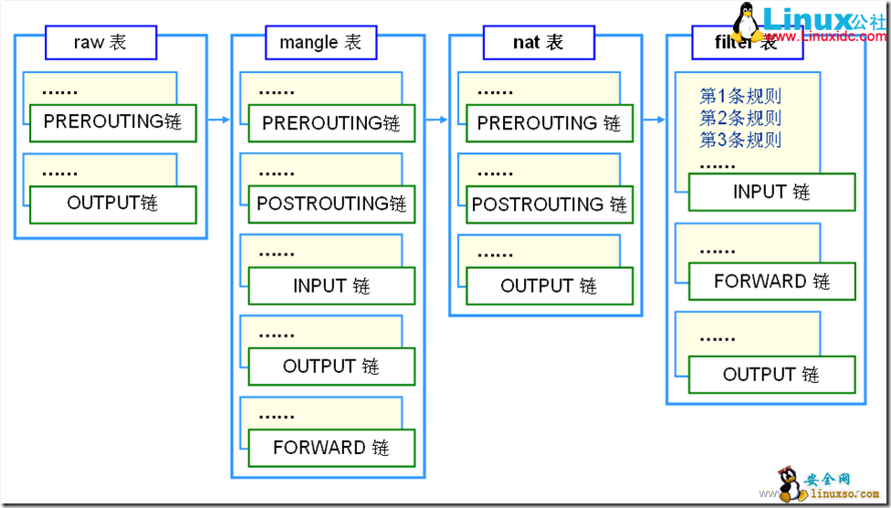
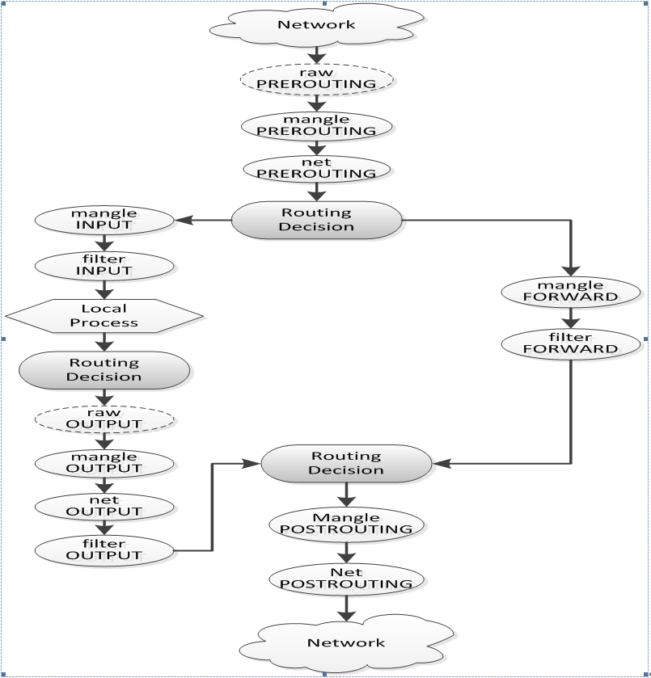

# netfilter&iptables

在linux上，防火墙其实是系统内核的一部分，基于Netfilter架构。其基本原理是在内核网络层数据包流经的不同位置设置一些钩子（hook），利用这些嵌入网络层的钩子（hook）来对数据抓取、控制或修改。iptables其实默认的netfilter的控制管理工具，所以使用ps或top看不到有一个“防火墙”进程的存在。“防火墙”不能被卸载也不能被关闭，“service iptables stop”或“service iptables stop”命令只是清空所有策略和表，并把默认策略改为ACCEPT。

netfilter组件处于内核空间（kernelspace），是内核的一部分，由一些信息包过滤表组成，这些表包含内核用来控制信息包过滤处理的规则集。

iptables组件是一个可执行程序，位于用户空间（userspace），它用来向过滤表中插入、修改和删除规则。

### 四表五链

iptables的四表五链，如下面的图所示。四张表为raw表、mangle表、nat表和filter表，五条链为PREROUTING链、INPUT链、OUTPUT链、FORWARD链和POSTROUTING链。

* 数据包到达本机后首先经过PREROUTING链，然后根据该链确定数据包后续的走向：
1. 目的地是本机，则发送到INPUT链

2. 如果满足PREROUTNG的nat表上的转发规则，则发送给FORWARD，然后经过POSTROUTING发送出去。
* 本机发送的数据包，直接发送给OUTPUT链，然后转给POSTROUTING链。




### 信息包的四种状态

* NEW
  
  NEW说明这个数据包是连接中的第一个包。意思就是conntrack模块看到的某个连接的第一个包，它即将被匹配。比如，我们看到一个SYN包，是我们所留意的连接的第一个数据包，就要匹配它。

* ESTABLISHED
  
  ESTABLISHED已经注意到两个方向上的数据传输，而且会继续匹配这个连接的包。一个连接只要发送数据包并接到应答，这个连接就是ESTABLISHED的了。一个连接要用NEW变为ESTABLISHED，只需要接到应答包即可，不管这个包是发往防火墙的，还是防火墙转发的。ICMP的错误和重定向等信息也被看做是ESTABLISHED，只要它们是我们所发出的信息的应答。

* RELATED
  
  当一个连接和某个已处于ESTABLISHED状态的连接有关系时，就被认为是RELATED的。一个连接要想是RELATED的，首先要有一个ESTABLISHED的连接，这个ESTABLISHED连接再产生一个主连接之外的连接，新的连接就是RELATED。

* INVALID
  
  INVALID状态显示该数据包与任何已知的流或连接都不相关，其说明数据包不能被识别属于哪个连接或没有任何状态。只有几个原因可以产生这种情况，比如：内存溢出、收到不知属于哪个连接的ICMP错误信息。一般，对于这种状态的数据包直接丢弃（DROP）即可。

### 几个重要的概念

#### 表(table)

iptables内置了4个表，即raw表、filter表、nat表和mangle表，分别用于实现包过滤、网络地址转换和包重构的功能

* raw表
  
  对收到的数据包在连接追踪前进行处理。此表的优先级高于ip_conntrack扩展模块和其他的table，可以包含POSTROUTING、OUTPUT两个内置chain。
  
  增加raw表，在其他表处理之前使用-j NOTRACK跳过其他表处理，状态处理以前的四个还增加了一个UNTRACKED。注意一旦NOTRACK了，就无法MASQUERD了。

* filter表
  
  filter表主要用于过滤数据包，根据预定义的一组规则过滤符合条件的数据包。对于“防火墙”而言，主要利用在filter表中指定的规则来实现对数据包的过滤。Filter表是默认的表，如果没有指定哪个表，iptables就默认使用filter表来指定所有命令。filter表包含了INPUT、FORWARD和OUTPUT链。在filter中只能对数据包进行接收、丢弃的操作，无法对数据包进行更改。

* nat表
  
  nat表主要用于网络地址转换，可以实现一对一、一对多和多对多的网络地址转换。NAT表包含了PROROUTING、POSTROUTING和OUTPUT链。

* mangle表
  
  mangle表主要用于对数据包进行更改。在内核版本2.4.18后的linux版本中该表包含的链为：INPUT链（处理进入的数据包），FORWARD链（处理转发的数据包）、OUTPUT数据包（处理本地生成的数据包）、POSTROUTING链（处理即将出去的数据包）和PREROUTING链（处理即将到来的数据包）

规则表之间的优先顺序（由高到低）

raw -> mangle -> nat -> filter

#### 链(chain)

链是数据包传播的途径，每条链由若干规则组成。当一个数据包到达一个链时，iptables就会从链中第一条规则开始检查，看该数据包是否满足规则所定义的条件。如果满足，系统就会根据该条规则所定义的方法处理该数据包；否则iptables将继续检查下一条规则，如果该数据包不符合链中任一条规则，iptables就会根据该链预先定义的默认策略来处理数据包。

系统默认的五条规则链为：

* INPUT：进来的数据包应用此规则链中的策略

* OUTPUT：外出的数据包应用此规则链中的策略

* FORWARD：本机转发的数据包应用此规则链中的策略

* PREROUTING：对数据包做路由选择前（确定数据包是发往本机还是进行路由）应用此链中的规则

* POSTROUTING：对数据包做路由选择后应用此链中的规则，所有出本机的数据包在出本机前都由这个链处理。

#### 规则(rule)

规则是网络管理源预定义的条件，规则一般的定义是“如果数据包符合这样的要求，就这样处理数据包”。规则存储在内核空间的数据包过滤表中，这些规则指定了源地址、目标地址、传输协议和服务类型以及对数据包的处理方法等。

处理数据包的方法包括：

* DROP：当一个数据包到达时，简单的丢弃，不做其他任何处理；

* ACCEPT：当一个数据包到达时接受数据包，允许数据包通过；

* REJECT：当一个数据包到达时丢弃数据包，但是会向发送这个包的源主机发送错误消息；

* JUMP： 后面跟另一条链的名字，表示要跳转到那个链上。

### 处理流程



从上图可以看出，对iptables数据包的处理分三种情况：

* 目的为本地主机的数据包
  
  1. 数据包从网络进入本机网卡
  
  2. 网卡收到数据包后，进入raw表的PREROUTING链。这个链的作用是在连接被追踪前处理报文，能够设置连接不被追踪。如果设置了连接追踪，则继续处理。
  
  3. 经过raw表后，进入mangle表的PREROUTING链。这个链主要用来修改报文的TOS、TTL以及给报文设置特殊的MARK。（注：通常mangle表以给报文设置MARK为主，在这个表里不要做过滤、NAT及伪装等操作）
  
  4. 进入nat表的PREROUTING链。这个链主要用来处理DNAT，应该避免在这条链上做过滤，否则可能造成有些报文会漏掉。（注：它只用来完成源/目的地址的转换）
  
  5. 进入路由决定数据包的处理
  
  6. 进入mangle表的INPUT链。在路由之后把数据包送给应用前，可以再次修改报文
  
  7. 进入filter表的INPUT链。在这里对所有送往本机用户空间的报文进行过滤，要注意所有收到的并且目的地址问本机的报文都会经过这个链
  
  8. 数据包最终进入用户空间，由本地应用进行处理

* 本地主机发出的数据包
  
  1. 本地应用发出数据包
  
  2. 路由选择，决定用哪个源地址及哪个端口发出，当然还有其他一些必要的信息
  
  3. 进入raw表的OUTPUT链。能够在连接追踪生效前对报文进行处理，可以标记某个连接不被追踪
  
  4. 进入mangle表的OUTPUT链，可以对数据包进行修改
  
  5. 进入nat表的OUTPUT链，可以对自己发出的数据包做DNAT
  
  6. 进入filter表的OUTPUT链，可以对本地发出的数据包进行过滤
  
  7. 进入mangle表的POSTROUTING链，可以对数据包进行修改
  
  8. 进入nat表的POSTROUTING链，在这里做SNAT。
  
  9. 进入网络

* 本机转发的数据包
  
  1. 数据包从网络进入本机网卡
  
  2. 网卡收到数据包后，进入raw表的PREROUTING链。这个链的作用是在连接被追踪前处理报文，能够设置连接不被追踪。如果设置了连接追踪，则继续处理。
  
  3. 经过raw表后，进入mangle表的PREROUTING链。这个链主要用来修改报文的TOS、TTL以及给报文设置特殊的MARK。（注：通常mangle表以给报文设置MARK为主，在这个表里不要做过滤、NAT及伪装等操作）
  
  4. 进入nat表的PREROUTING链。这个链主要用来处理DNAT，应该避免在这条链上做过滤，否则可能造成有些报文会漏掉。（注：它只用来完成源/目的地址的转换）
  
  5. 进入路由决定数据包的下一步处理
  
  6. 进入mangle表的FORWARD链，可以对数据包进行修改
  
  7. 进入filter表的FORWARD链，在这里对转发的数据包进行过滤
  
  8. 进入mangle表的POSTROUTING链，对数据包进行修改
  
  9. 进入nat表的POSTROUTING链，在这里一般用来做SNAT
  
  10. 进入网络

### 规则执行顺序

iptables执行规则时，在规则表中按从上到下的顺序执行的，如果没有遇到匹配的规则，就一条一条往下执行，如果遇到匹配的规则后，就执行本规则。执行后根据本规则的动作，决定下一步的执行情况。后续执行一般有三种情况：

1. 继续执行当前规则内的下一条规则。比如执行filter队列内的LOG后，还会执行filter队列内的下一条规则；

2. 终止当前规则的执行，转到下一条规则队列。比如执行过accept后就中断filter队列内的其他规则，调到nat队列规则去执行；

3. 终止所有规则队列的执行

iptables会在整个流程中对符合某条规则的数据包进行处理，处理动作除了ACCEPT、REJECT、DROP、REDIRECT和MASQUERADE以外，还有LOG、ULOG、DNAT、SNAT、MIRROR、QUEUE、RETURN、TOS、TTL和MARK等，其中某些处理动作不会中断过滤程序，某些处理动作则会中断同一规则链的过滤，并依照前述流程继续进行下一规则链的过滤，一直到规则堆栈中的规则检查完毕为止。

* ACCEPT 将数据包放行，进行完此处理动作后，将不再对比其他规则，直接跳往下一规则链

* REJECT 拒绝数据包，并传送数据包通知对方，可以传送的数据包有几个选择：ICMP port-unreachable、ICMP echo-reply或者tcp-reset（这个数据包会要求对方关闭连接），进行完此处理动作后，将不再比对其它规则，直接中断过滤程序。

* DROP 丢弃数据包，进行完此处理后，将不再比对其他规则，直接中断过滤程序。

* REDIRECT 将数据包重新导向另一个端口（PNAT），进行完此处理后，将会继续比对其他规则

* MASQUERADE 改写封包来源IP为防火墙NIC IP，可以指定port对应的范围，进行完此处理后，直接跳往下一规则链。这个功能与SNAT略有不同，当进行IP伪装时，不需要指定要伪装成哪个IP，IP会从网卡直接读取。

* LOG 将封包信息记录在/var/log中，进行完此处理后，将会继续比对其他规则

* SNAT 改写封包来源IP为某特定IP或IP范围，可以指定port对应的范围，进行完此处理后将直接跳往下一规则链

* DNAT 改写封包目的IP为某特定IP或IP范围，可以指定port对应的范围，进行完此处理后，将会直接跳往下一规则链

* MIRROR 镜像封包，也就是将来源IP与目的IP对调后，将封包送回，进行完此处理后，将会中断过滤程序

* QUEUE 中断过滤程序，将封包放入队列，交给其他程序处理。

* RETURN 结束在目前规则链中的过滤程序，返回主规则链继续过滤，如果把自定规则链看成是一个子程序，那么这个动作就相当于提早结束子程序并返回到主程序中

* MARK 将封包打上某个标记，以便提供作为后续过滤的条件判断，进行完此处理动作后，将会继续比对其他规则

### iptables命令

| 表      | 说明                            | 支持的链                                        |
| ------ | ----------------------------- | ------------------------------------------- |
| raw    | 一般是为了不再让iptables对数据包进行跟踪，提高性能 | PREROUTING、OUTPUT                           |
| mangle | 对数据包进行修改                      | PREROUTING、INPUT、FORWARD、OUTPUT、POSTROUTING |
| nat    | 进行地址转换                        | PREROUTING、OUTPUT、POSTROUTING               |
| filter | 对包进行过滤                        | INPUT、FORWARD、OUTPUT                        |

用法：

       iptables -[ACD] chain rule-specification [options]
       iptables -I chain [rulenum] rule-specification [options]
       iptables -R chain rulenum rule-specification [options]
       iptables -D chain rulenum [options]
       iptables -[LS] [chain [rulenum]] [options]
       iptables -[FZ] [chain] [options]
       iptables -[NX] chain
       iptables -E old-chain-name new-chain-name
       iptables -P chain target [options]
       iptables -h (print this help information)

--append   -A chain                        在指定链尾部添加规则

--check       -C chain                        检查指定链上的指定规则是否存在

--delete      -D chain                        从指定链中删除匹配的规则

--delete      -D chain rulenum     从指定链中删除第rulenum个规则（从1开始编号）

--insert       -I   chain [rulenum]  在指定链中的第rulenum位插入规则

--replace   -R chain rulenum      替换指定链中的第rulenum个规则（从1开始编号）

--list            -L [chain [rulenum]] 列出指定的规则或所有链中规则

--list-rules -S [chain [rulenum]] 打印指定的规则或所有链中的规则

--flush         -F [chain]                       删除指定的链中的规则或所有链中的规则

--zero          -Z [chain]                       将指定链或所有链中的技术器清零

--new          -N [chain]                       创建一个用户自定义的链

--delete-chain -X [chain]                删除一个用户自定义链

--policy     -P chain target               修改链上的默认策略

--rename-chain -E old-chain new-chain 修改链名

可选项：

   --ipv4            -4     

   --ipv6            -6

[!]--protocol        -p  proto                                  协议，数字或名字，`tcp`等

[!]--source            -s  address[/mask][...]      源地址

[!]--destination  -d  address[/mask][...]     目的地址

[!]--in-interface -i input name[+]                   网卡名（[+] for wildcard）

  --jump     -j  target                                               跳转到某条规则

  --goto      -g  chain                                               跳转到某条规则，不返回

  --match  -m match                                             扩展匹配

  --numeric -n                                                          以数字形式输出地址或端口

[!]--out-interface -o output name[+]             网卡名（[+] for wildcard）

  --table     -t table                                                   操作的表，`nat`及`filter`等

  --verbose -v                                                            输出详细信息

  --wait -w [seconds]                              maximum wait to acquire xtables lock before give up

  --wait-interval -W [usecs]         wait time to try to acquire xtables lock default is 1 second

  --line-numbers                                                      打印行号

  --exact        -x                                                            expand numbers (display exact values)

[!]--fragment -f                                                          match second or further fragments only

  --modprobe=<command>                                 try to insert modules using this command

  --set-counters PKTS BYTES                                set the counter during insert/append

[!] --version -V                                                            打印版本号

  

### 常见的规则

#### state

--state: 指定要匹配的包的状态，当前有四种状态可用，即上面的NEW、ESTABLISHED、RELATED及INVALID四种。

```shell
#iptables -A FORWARD -p tcp -m state --state RELATED,ESTABLISHED -j ACCEPT
```

表示凡是数据包状态为“RELATED”、“ESTABLISHED”的tcp包允许通过防火墙。

#### multiport

在一条策略中匹配那些端口不连续的服务

```shell
#iptables -A FORWARD -i eth0 -p tcp -m multiport --dports 25,80,110,443,1863 -j ACCEPT
#iptables -A FORWARD -i eth0 -p udp --dport 53 -j ACCEPT
```
