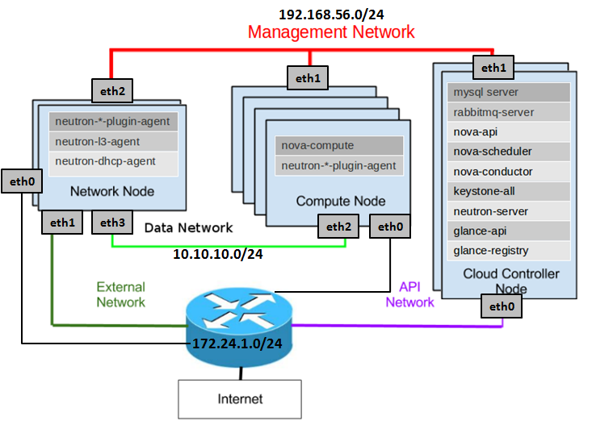
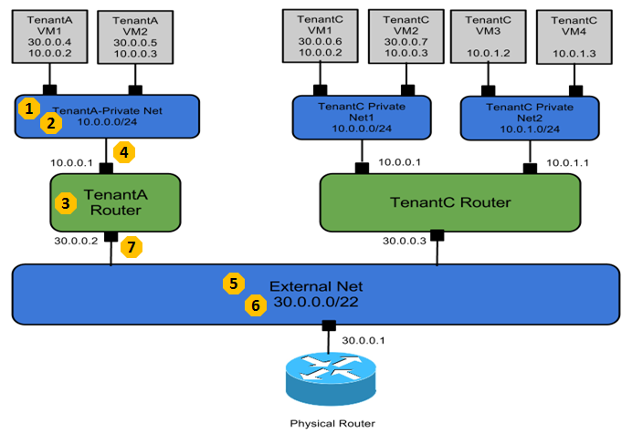
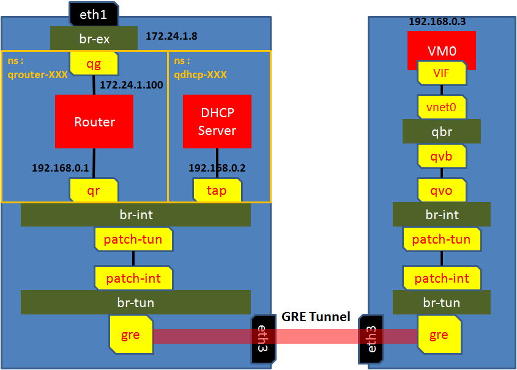
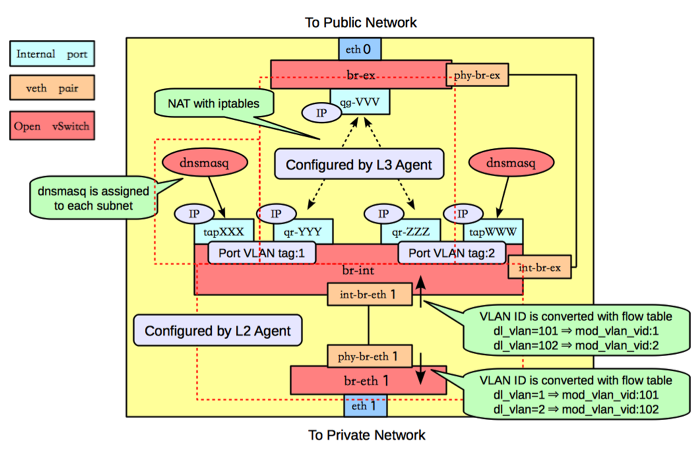
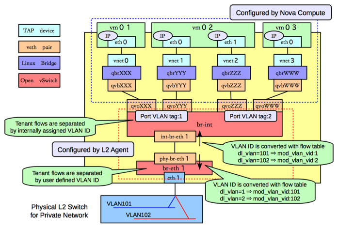

neutron
===

## 概述
neutron是OpenStack中提供网络服务的核心组件，基于软件定义网络，实现软件化的网络资源管理，在实现上充分利用了Linux系统中的各种网络相关技术，支持第三方插件。

neutron是用来创建虚拟网络的，所谓虚拟网络，就是虚拟机启动的时候会有一个虚拟网卡，虚拟网卡会连接到虚拟的switch上，虚拟的switch连接到虚拟的router上，虚拟的router最终和物理网卡联通，从而虚拟网络和物理网络联通起来。

## 模块
下面是三节点的openstack模块图

neutron分成多个模块并分布在多个节点上:
1. Controller节点
* neutron-server，用于接受API请求创建网络，子网，路由器等，然而创建的这些东西仅仅是一些数据结构在数据库里面

2. Network节点
* neutron-l3-agent，用于创建和管理虚拟路由器，当neutron-server将路由器的数据结构创建好，它是做具体的事情的，真正的调用命令行将虚拟路由器，路由表，namespace，iptables规则全部创建好
* neutron-dhcp-agent，用于创建和管理虚拟DHCP Server，每个虚拟网络都会有一个DHCP Server，这个DHCP Server为这个虚拟网络里面的虚拟机提供IP
* neutron-openvswith-plugin-agent，这个是用于创建虚拟的L2的switch的，在Network节点上，Router和DHCP Server都会连接到二层的switch上
* neutron-metadata-agent: 运行在网络节点上，用来响应Nova的metadata服务
* neutron-l2-agent: 二层代理，用于管理VLAN的插件，接受Neutron-server的指令创建VLAN(**待确认**)

3. Compute节点
* neutron-openvswith-plugin-agent，这个是用于创建虚拟的L2的switch的，在Compute节点上，虚拟机的网卡也是连接到二层的switch上

各个模块负责的功能如下：
1. neutron-server 接收其他openstack组件的api调用，并发送到对应的neutron-plugin上
2. neutron-plugin 实现网络功能，但具体的实现交给对应的neutron-agent
3. neutron-agent 模拟出具体设备，接受neutron-plugin的调用进行具体创建

### neutron-plugin
1. core plugin
* ml2，负责L2网络连接，具体为在数据链路层，基于mac地址的二层网络，以广播的形式发包，提供子网和端口。具体的实现有vlan、vxlan、gre、flat以及local
2. service plugin
* L3 router
* firewall
* landbalancer
* vpn
* metering

## neutron租户网络

openstack中为租户创建网络以及连接外网的步骤如下:
1. 为Tenant创建一个private network，不同的private network是需要通过VLAN tagging进行隔离的，互相之间broadcast不能到达，这里我们用的是GRE模式，也需要一个类似VLAN ID的东西，称为Segment ID
2. 创建一个private network的subnet，subnet才是真正配置IP网段的地方，对于私网，我们常常用192.168.0.0/24这个网段
3. 为这个Tenant创建一个Router，以便租户能够访问外网
4. 将private network连接到Router上
5. 创建一个External Network
6. 创建一个Exernal Network的Subnet，这个外网逻辑上代表了我们数据中心的物理网络，通过这个物理网络，我们可以访问外网。因而PUBLIC_GATEWAY应该设为数据中心里面的Gateway， PUBLIC_RANGE也应该和数据中心的物理网络的CIDR一致，否则连不通，而之所以设置PUBLIC_START和PUBLIC_END，是因为在数据中心中，不可能所有的IP地址都给Openstack使用，另外可能搭建了VMware Vcenter，可能有物理机器，仅仅分配一个区间给Openstack来用。
7. 将Router连接到External Network

经过上面的流程，从虚拟网络到物理网络就在逻辑上联通了。

## neutron网络拓扑

### gre

### vlan
#### 网络节点

#### 计算节点

在vlan实现模型中，有三种类型的网桥
1. qbr(quantum bridge)，常见实现载体linux bridge，引入qbr主要是利用iptables实现security group功能
2. br-int(integration bridge)，常见实现载体openvswitch网桥，qbr与br-int之间通过vethpair连接，vm与qbr直接通过tap连接
3. br-ex常见实现载体openvswitch网桥，负责外部通信，br-ex与br-int之间通过vethpair连接

关于为什么有qbr网桥的问题：
1. 和security group的概念有关，openstack中的security group中开通哪些端口，屏蔽哪些端口是用iptables来实现的，
2. 然而br-int这些虚拟bridge都是openvswitch创建的，br-int上面有很多openvswitch的规则，比如vlan tag等。
3. openvswitch的kernel mode和netfilter的kernel mode不兼容，一个IP包进来要么走iptables的规则进行处理，要么走openvswitch的规则进行处理，所以iptables必须要另外建立一个linux bridge来做，因而有了qbr。
4. 在了解拓扑结构的时候，可以将qbr忽略，看成VM直接连接到br-int上就可以了。