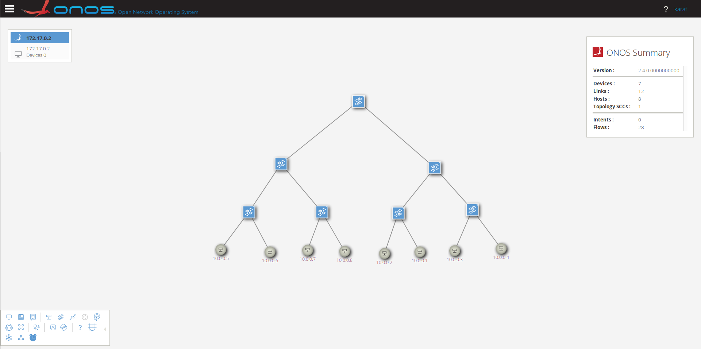

docker安装onos
===

## onos安装
采用docker方式安装
### 在docker hub中搜索onos镜像
```shell
$ sudo docker search onos
NAME                                 DESCRIPTION                                     STARS               OFFICIAL            AUTOMATED
onosproject/onos                     ONOS is a SDN Network Operating System built…   51                                      [OK]
sdnhub/onos                          ONOS Docker distribution for version Blackbi…   4                                       [OK]
maojianwei2020/onos_docker_cluster   Mao ONOS Cluster Instance in Docker, by Jian…   1                                       [OK]
onosproject/protoc-go                Protoc compilation for golang                   1                                       
opencord/onos                                                                        1                                       
onosproject/onos-config              ONOS configuration manager                      0                                       
onosproject/device-simulator         ONOS device simulator                           0                                       
opensona/onos-sona-repo-build        An ONOS docker file that builds SONA applica…   0                                       [OK]
onosproject/onos-topo                                                                0                                       
onosproject/onos-gui                 GUI implementation for µONOS Architecture       0                                       
onosproject/onos-cli                                                                 0                                       
matteoscandolo/onos                                                                  0                                       
xosproject/onos-synchronizer         XOS ONOS Synchronizer                           0                                       
onosproject/golang-build             Golang build environment for ONOS               0                                       
onosproject/onos-docs-manager                                                        0                                       
onosproject/fabric-p4test            Docker image to run PTF-based data plane tes…   0                                       
breezestars/onos-p4                  The environment for ONOS user to develop P4 …   0                                       [OK]
onosproject/onos-docs-base                                                           0                                       
onosproject/onos-ztp                 Zero Touch Provisioning application for ONOS    0                                       
opensona/onos-sona-nightly-docker    A nightly released docker image of stable ON…   0                                       [OK]
onosproject/onos-config-tests                                                        0                                       
opensona/onos-sona-docker            An ONOS docker file that activates SONA appl…   0                                       [OK]
ciena/onosms                         ONOS 1.3 (drake) compatible with Kubernetes …   0                                       [OK]
onosproject/onos-test-runner                                                         0                                       
cachengo/onos-synchronizer                                                           0                        
```

### 拉取镜像
```shell
$ sudo docker pull onosproject/onos
```

### 创建容器实例
```shell
$ sudo docker run -t -d --name onos onosproject/onos
```

### 查看已创建的实例
```shell
$ sudo docker ps 
CONTAINER ID        IMAGE               COMMAND                  CREATED             STATUS              PORTS                                              NAMES
3e42fce4343d        onosproject/onos    "./bin/onos-service …"   26 minutes ago      Up 26 minutes       6640/tcp, 6653/tcp, 8101/tcp, 8181/tcp, 9876/tcp   onos
```

### 获取已创建实例的IP地址
```shell
$ sudo docker inspect --format '{{ .NetworkSettings.IPAddress }}' onos
172.17.0.2
```

### 连接到onos
有两种方式可以连接到onos，分别是使用ssh和使用web图形界面
#### 采用ssh
```shell
$ ssh -p 8101 karaf@172.17.0.2
Password authentication
Password: 
Welcome to Open Network Operating System (ONOS)!
     ____  _  ______  ____     
    / __ \/ |/ / __ \/ __/   
   / /_/ /    / /_/ /\ \     
   \____/_/|_/\____/___/     
                               
Documentation: wiki.onosproject.org      
Tutorials:     tutorials.onosproject.org 
Mailing lists: lists.onosproject.org     

Come help out! Find out how at: contribute.onosproject.org 

Hit '<tab>' for a list of available commands
and '[cmd] --help' for help on a specific command.
Hit '<ctrl-d>' or type 'logout' to exit ONOS session.
```

注：
  登陆用户名和密码为：karaf:karaf

#### 使用图形界面
打开浏览器，在地址栏输入:`http://172.17.0.2:8181/onos/ui/login.html'

登陆帐号为：karaf:karaf

## mininet安装
新创建一个ubuntu虚拟主机

### 安装mininet
```shell
$ sudo apt install mininet
```

## 测试mininet和onos
### 开启onos的openflow和fwd模块
#### ssh连接onos
```shell
$ ssh -p 8101 karaf@172.17.0.2
```

#### 开启openflow和fwd模块
```shell
karaf@root > app activate org.onosproject.openflow
karaf@root > app activate org.onosproject.fwd
```

#### mininet创建拓扑并连接到onos
```shell
$ sudo mn --topo tree,3,2 --controller remote,ip=172.17.0.2
*** Creating network
*** Adding controller
Connecting to remote controller at 172.17.0.2:6653
*** Adding hosts:
h1 h2 h3 h4 h5 h6 h7 h8 
*** Adding switches:
s1 s2 s3 s4 s5 s6 s7 
*** Adding links:
(s1, s2) (s1, s5) (s2, s3) (s2, s4) (s3, h1) (s3, h2) (s4, h3) (s4, h4) (s5, s6) (s5, s7) (s6, h5) (s6, h6) (s7, h7) (s7, h8) 
*** Configuring hosts
h1 h2 h3 h4 h5 h6 h7 h8 
*** Starting controller
c0 
*** Starting 7 switches
s1 s2 s3 s4 s5 s6 s7 ...
*** Starting CLI:
mininet>
```

#### 测试各节点之间的连通性
```shell
mininet> pingall
*** Ping: testing ping reachability
h1 -> h2 h3 h4 h5 h6 h7 h8 
h2 -> h1 h3 h4 h5 h6 h7 h8 
h3 -> h1 h2 h4 h5 h6 h7 h8 
h4 -> h1 h2 h3 h5 h6 h7 h8 
h5 -> h1 h2 h3 h4 h6 h7 h8 
h6 -> h1 h2 h3 h4 h5 h7 h8 
h7 -> h1 h2 h3 h4 h5 h6 h8 
h8 -> h1 h2 h3 h4 h5 h6 h7 
*** Results: 0% dropped (56/56 received)
```

#### 在ONOS的web界面查看拓扑
